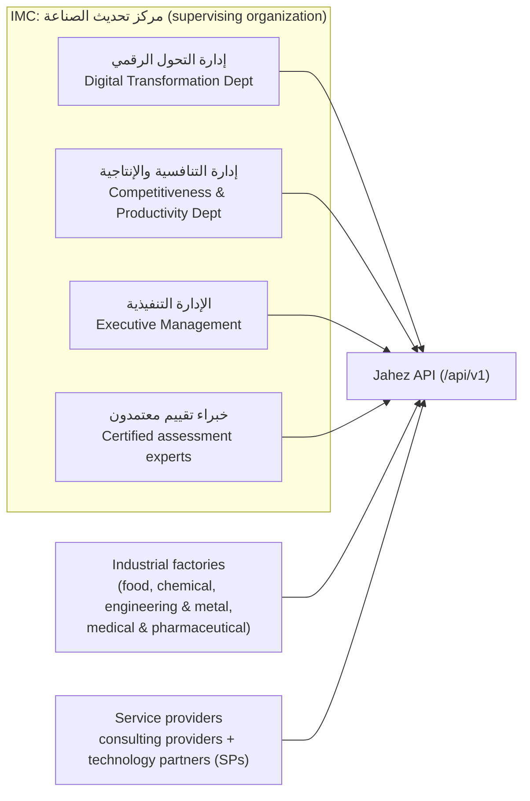
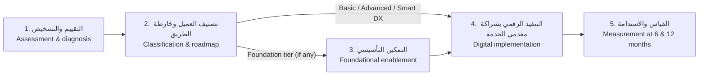

# Architecture

**Status:** Phases 4–7 (2026-10-03). Section 1 is the current state, verified by inspection. Sections 3.1, 3.2 and 4 note which items are now **implemented**. Everything else in sections 2–6 remains a **PROPOSED** target that needs approval and an ADR before it is built.

## 1. Current state (verified)

A Laravel 12 application with the platform foundation (Phase 1), the reference data (Phase 2), accounts, roles and organizations (Phase 3), the audit log (Phase 8 slice) and the first hardening pass (Phase 9). Phases 4–6 added:
- the service catalog from the services workbook;
- provider profiles, IMC approval and the provider directory;
- the digital readiness assessment with server-side scoring and classification ([ADR-018](decisions/ADR-018-digital-readiness-assessment.md); it replaced manual classification);
- the factory-initiated marketplace: service requests, provider answers, private negotiation and versioned offers.

**Billing (Phase 7) does not exist:** it is blocked on [OQ-15](open-questions.md#oq-15) and [OQ-16](open-questions.md#oq-16). The Phase 0 starting point is recorded in [phases/phase-00-discovery.md](phases/phase-00-discovery.md).

| Area | State | Evidence |
| --- | --- | --- |
| Version control | git: `main` (`020f811`) → `phase/01-foundation` (`fc7b89d`) → `phase/02-data-model` (`6b9127d`) → `phase/03-auth` (`4446cba`) → `phase/08-09-audit-and-hardening` (`368ca11`) → `phase/10-tooling-and-api-only` (`e921f24`) → `phase/04-07-marketplace` (current work); **no remote** | `git log`, [ADR-001](decisions/ADR-001-version-control.md) |
| PHP / framework | PHP 8.2.12 (XAMPP), Laravel 12.69.3 | `php -v`, `php artisan --version` |
| Direct packages | laravel/framework 12.69.3, laravel/sanctum 4.3.3, laravel/tinker 2.11.1; dev: larastan/larastan 3.12.2, laravel/boost 2.10.1, pail 1.2.7, pint 1.30.4, sail 1.68.0, pestphp/pest 3.8.7, pest-plugin-laravel 3.2.0, mockery 1.6.15, collision 8.9.5, fakerphp/faker 1.24.1 (no new packages in Phases 2–7) | `composer show --direct` |
| Routes (app) | **API-only** ([ADR-013](decisions/ADR-013-api-only.md)): no web routes, no Sanctum CSRF-cookie route. `GET /up` (liveness), `GET /api/v1/health`, `POST /api/v1/auth/{login,logout,forgot-password,reset-password}`, `GET /api/v1/me`, list/create/show/update on `/api/v1/factories`, `/api/v1/service-providers`, `/api/v1/users` (numeric IDs only), `POST /service-providers/{id}/approval`, `GET /factories/{id}/assessments` (legacy, read-only), `GET /readiness-questionnaire`, `GET|POST /factories/{id}/readiness-assessments[/{id}]`, `GET /catalog/{categories,services}[/{id}]`, `GET /provider-directory`, `/service-requests` (list, create, show, cancel), `/provider-requests` (list, show, accept, decline, withdraw, messages, offers, accept offer), `/reference/*`, `/provider-directory/{id}`, provider evaluations and review requests, thread history, `POST /service-requests/{id}/providers`, `/agreements`, `/contracts`, `/invoices` (lines, issue, cancel, payments), `GET /billing/configuration`, `POST /payment-gateways/{key}/callback` (public, verified by the gateway adapter), `GET /api/v1/audit-logs` ([api-endpoints.md](api-endpoints.md)). 72 routes under `/api/v1`. No `storage/{path}` route (local disk `serve => false`). | `php artisan route:list` |
| Middleware | `SecurityHeaders` (outermost) and `AssignRequestId` prepended to the global stack; `throttle:api` on the `api` group (health excluded) | `bootstrap/app.php`, [api-conventions.md §5](api-conventions.md#5-headers-in-force) |
| Exceptions | `ApiExceptionRenderer` renders all `api/*` exceptions as the JSON envelope | `bootstrap/app.php`, [ADR-009](decisions/ADR-009-error-envelope-and-request-id.md) |
| Models | `User` (Sanctum tokens, `role` enum, `factory_id`/`service_provider_id`, `deactivated_at`), `Factory`, `ServiceProvider` (a domain model, not a Laravel service provider), Phase 2 reference models, `AuditLog` (append-only, [ADR-012](decisions/ADR-012-audit-log.md)); P4 `ServiceCategory`, `CatalogService`; P5 `FactoryAssessment` (append-only); P6 `ServiceRequest`, `ProviderRequest`, `ProviderRequestMessage` and `Offer` (both append-only); `ProviderEvaluation`, `ProviderEvaluationScore`, `ProviderRequestTransition` (append-only); P7 boundaries `Agreement` (immutable), `Contract`, `Invoice`, `InvoiceLine`, `Payment`, `PaymentEvent` (append-only). Money, billing policy and the payment-gateway contract live in `app/Billing` ([ADR-017](decisions/ADR-017-agreements-contracts-billing.md)). `Model::shouldBeStrict()` outside production. | `app/Models/` |
| Authorization | `App\Enums\Role`, `App\Enums\Permission`; policies `FactoryPolicy`, `ServiceProviderPolicy`, `UserPolicy` (cross-tenant → 404), `AuditLogPolicy`, `FactoryAssessmentPolicy`, `ServiceRequestPolicy`, `ProviderRequestPolicy` (competing providers → 404), `AgreementPolicy`, `ContractPolicy`, `InvoicePolicy` | `app/Policies/`, [roles-permissions.md](roles-permissions.md) |
| Jobs / notifications | `SendPasswordResetLink`, `SendAccountInvitation` (queued; tokens created inside the job); `PasswordResetLink`, `AccountInvitation` emails | `app/Jobs/`, `app/Notifications/`, [ADR-011](decisions/ADR-011-account-provisioning-and-credentials.md) |
| Console | `app:create-admin` (first administrator); `app:check-production` (go-live gate, [deployment.md](deployment.md)); `sanctum:prune-expired` scheduled daily | `app/Console/Commands/`, `routes/console.php` |
| Migrations | skeleton + `personal_access_tokens` + 7 reference tables (P2) + `factories`, `service_providers`, `factory_sector`, `sector_service_provider`, and on users: role, organization, deactivation and a CHECK constraint (P3); `audit_logs` (P8); `service_categories`, `catalog_services`, provider profile and approval columns, `catalog_service_service_provider` (P4); `factory_assessments` (P5); `service_requests`, `provider_requests`, `provider_request_messages`, `offers` (P6); `factories.size`, `provider_evaluations`, `provider_evaluation_scores`, `provider_request_transitions`, `offers.valid_until`; `agreements`, `contracts`, `invoices`, `invoice_lines`, `invoice_number_sequences`, `payments`, `payment_events` (P7 boundaries); `readiness_questionnaires`, `readiness_pillars`, `readiness_questions`, `readiness_choices`, `readiness_categories`, `readiness_recommendations`, `catalog_service_readiness_recommendation`, `readiness_assessments`, `readiness_assessment_answers` (ADR-018) | `database/migrations/`, [data-model.md](data-model.md) |
| Seeders | `DatabaseSeeder` → `ReferenceDataSeeder` (everywhere; includes the P4 `ServiceCatalogSeeder`: 7 categories, 42 services, each citing its workbook cell). Local/testing only: admin `test@example.com` + `LocalDemoSeeder` (2 factories, 2 approved providers offering a few services, 1 member each). | `database/seeders/` |
| Database | **MySQL** driver → local MariaDB 10.4.32; databases `jahez` (dev), `jahez_testing` (tests), `utf8mb4_unicode_ci` | `.env`, `phpunit.xml`, [ADR-004](decisions/ADR-004-database-mysql.md) |
| Cache / queue / session | `database` drivers (no Redis). **A queue worker is required** for invitation and reset emails. | `.env`, README |
| CORS | Published; origins from `CORS_ALLOWED_ORIGINS` (empty = none); exposes `X-Request-Id`, `Retry-After`, `X-RateLimit-*` | `config/cors.php` |
| Rate limit | `api` limiter: `API_RATE_LIMIT_PER_MINUTE` (60) per user or guest IP; `negotiation-messages` (30 per minute per user) and `negotiation-offers` (10) | `AppServiceProvider`, `config/api.php` |
| Tests | Pest on MySQL, `LazilyRefreshDatabase`, global `Http::preventStrayRequests()` + `Sleep::fake()`; 823 tests (2572 assertions), run on both MariaDB 10.4 and MySQL 8.4, serial and parallel, including policy matrices and lock-sequence checks; k6 scripts in `tests/performance/` | `tests/`, [testing/strategy.md](testing/strategy.md) |
| Static analysis | Larastan level 8, 0 errors, no excluded paths | `phpstan.neon` |
| AI tooling | `.ai/guidelines/jahez.md` merged into the generated `AGENTS.md` | [ADR-007](decisions/ADR-007-agent-guidelines.md) |
| CI / containers | None (no remote yet) | — |
| Local tools | Installed 2026-10-03 (approved): gitleaks 8.30.1, k6 2.2.0, MySQL 8.4.9 on port 3307. Not installed: Redis, Locust, Newman, Docker, OpenAPI tooling. | [Phase 10 log](phases/phase-10-performance-prep.md) |
| Host | AMD Ryzen 7 7735HS (16 logical CPUs), 15.3 GB RAM, Windows 11 | CIM query |

## 2. System context (actors from DOC)



Platform roles that map onto these actors are **OPEN-QUESTION** ([OQ-21](open-questions.md#oq-21), [OQ-08](open-questions.md#oq-08), [OQ-18](open-questions.md#oq-18)).

## 3. Proposed application architecture (PROPOSED)

### 3.1 API style and versioning (implemented in Phase 1)
- JSON REST API under **`/api/v1`**, defined in `routes/api.php` ([ADR-002](decisions/ADR-002-api-versioning-and-sanctum.md), [api-conventions.md](api-conventions.md)).
- `php artisan install:api` added `laravel/sanctum` (approved). Authentication itself arrives in Phase 3.
- **API-only** (owner decision 2026-10-03, [ADR-013](decisions/ADR-013-api-only.md)): the welcome route, web routes and the Vite/Tailwind tooling were removed, and so was Sanctum's CSRF-cookie route.

### 3.2 Request pipeline

```
Route (/api/v1, throttle, auth) → Form Request (validate + authorize)
  → thin Controller → Action class (multi-step / transactional work only)
  → Eloquent models (+ Policies for record-level authorization)
  → API Resource (explicit field allow-list) → JSON envelope
```

- **Controllers** stay thin and coordinate HTTP concerns only (laravel-best-practices `routing.md`).
- **Form Requests** handle all untrusted input, including allow-listed filter and sort fields.
- **Policies** cover every model that has an owner. Cross-tenant reads return **404**, not 403, so other tenants' records are not revealed to exist (testing-best-practices `endpoint-tests.md`).
- **Action classes** are used only for multi-step state changes that need a transaction or locking. A new `app/Actions` directory needs approval, because `AGENTS.md` forbids new base folders without it.
- **Enums** (PHP backed enums, TitleCase keys per `AGENTS.md`) hold closed sets such as workflow states.
- **API Resources** control the fields each response exposes.

### 3.3 Logical modules

These modules live inside Laravel's default directories. This is not a modular-monolith folder structure.

| Module | Responsibility | Source basis | Earliest phase | Blocked by |
| --- | --- | --- | --- | --- |
| Platform foundation | Versioning, error envelope, health/readiness, request ID, logging, rate limits | PROPOSED, now implemented | **Done (P1)** | — |
| Identity & Access | Users, authentication, roles, organization membership, token lifecycle | PROPOSED (D1–D3); actors SOURCE-REQUIRED | **Done (P3)** | Confirmation: [OQ-18](open-questions.md#oq-18), [OQ-21](open-questions.md#oq-21), [OQ-22](open-questions.md#oq-22), [OQ-33](open-questions.md#oq-33) |
| Reference Data | Sectors, maturity tiers, pathways/levels and their scope items, per-level provider requirements, evaluation criteria | SOURCE-REQUIRED (DOC §1, §3, §4, §6) | **Done (P2)**: tables, models, seeders; no endpoints yet | Proofreading [OQ-32](open-questions.md#oq-32); English [OQ-23](open-questions.md#oq-23) |
| Catalog | Service categories and services | Workbook (WB) | **Done (P4)**, [ADR-014](decisions/ADR-014-catalog-and-provider-profiles.md) | — |
| Organizations | Factory profiles, provider profiles | WB (provider fields); DOC (sectors) | **Providers: workbook fields (P4). Factories: name + sectors (P3), self-edit (P5)** | Factory fields [OQ-19](open-questions.md#oq-19); required provider fields [OQ-36](open-questions.md#oq-36) |
| Provider Evaluation | Weighted evaluation (30/25/20/15/10), level eligibility, approval | SOURCE-REQUIRED (DOC §3, §6) | **Manual IMC approval done (P4)**; weighted evaluation not built | [OQ-13](open-questions.md#oq-13), [OQ-14](open-questions.md#oq-14) |
| Assessment & Classification | Readiness assessment, maturity score, infrastructure & cyber audit, category assignment | SOURCE-REQUIRED (DOC §2, §4; RDA) | **Readiness assessment done** ([ADR-018](decisions/ADR-018-digital-readiness-assessment.md)): questionnaire, server-side score and category, recommendations. Infrastructure & cyber audit not built | [OQ-08](open-questions.md#oq-08) (expert validation), [OQ-10](open-questions.md#oq-10), [OQ-41](open-questions.md#oq-41), [OQ-42](open-questions.md#oq-42) |
| Roadmaps | 2–3-year path per factory | SOURCE-REQUIRED (DOC §1, §7) | P5 | [OQ-12](open-questions.md#oq-12) |
| Engagements | Factory-initiated marketplace: requests to several providers, independent answers, private negotiation, versioned offers | OWNER decision (OQ-03 answered) | **Done (P6)**, [ADR-015](decisions/ADR-015-marketplace-requests.md); states PROPOSED | [OQ-38](open-questions.md#oq-38), [OQ-39](open-questions.md#oq-39), [OQ-40](open-questions.md#oq-40) |
| Contracts | Draft or binding agreements | Partly (DOC §5, §6) | **Boundaries built (ADR-017):** immutable agreements; contract drafts with the DOC §6 knowledge-transfer commitment; never binding, no signature | **[OQ-17](open-questions.md#oq-17)** |
| Finance | Revenue sharing, invoices, payments | Concept only (DOC §5) | **Boundaries built (ADR-017):** invoices and payments; every money operation refused until its owner-set rule exists; no gateway adapter ships | **[OQ-15](open-questions.md#oq-15)**, **[OQ-16](open-questions.md#oq-16)** |
| Impact Measurement | Baseline, 6- and 12-month measurements | SOURCE-REQUIRED (DOC §2.2, §7.5) | P5/P8 | [OQ-11](open-questions.md#oq-11) |
| Notifications | Event notifications | PROPOSED | P8 | [OQ-26](open-questions.md#oq-26) |
| Audit | Append-only log of security events | **Implemented (P8 slice)**, [ADR-012](decisions/ADR-012-audit-log.md) | P8 | Retention: [OQ-25](open-questions.md#oq-25) |
| Reporting | KPIs (DOC §8), admin aggregates | SOURCE-REQUIRED (KPIs) | P8 | [OQ-27](open-questions.md#oq-27) |

### 3.4 Tenancy and authorization model (PROPOSED)
- There are three account families: **IMC staff**, **factory members** and **provider members**. A factory or provider user belongs to exactly one organization through a membership record. The organization ID is **never accepted from the client**; it comes from the authenticated user's membership.
- Every query for tenant-owned data is scoped to the actor's organization. A policy check then runs on the resolved record.
- IMC staff permissions are granular, not one "admin" flag, so they can map to the DOC §7 units once [OQ-21](open-questions.md#oq-21) is answered.
- Whether to use a role/permission package or a home-grown table is a Phase 3 decision that needs an ADR. Adding a package is a dependency change and needs approval.

## 4. Cross-cutting concerns

| Concern | Design | Status |
| --- | --- | --- |
| Error format | One JSON envelope for all `api/*` errors via a `$exceptions->render()` callback (`ApiExceptionRenderer`). No traces or SQL when `APP_DEBUG=false`. | **Implemented P1** ([ADR-009](decisions/ADR-009-error-envelope-and-request-id.md)) |
| Health | `/up` stays the liveness probe. `GET /api/v1/health` is a separate readiness endpoint (database reachable). It was not built as a `DiagnosingHealth` listener on `/up`, so a database outage does not fail the liveness probe and trigger restarts. | **Implemented P1** |
| Correlation | `AssignRequestId` (global) adds `request_id` to `Context` (so it reaches logs, queued jobs and audit entries) and to the `X-Request-Id` header. | **Implemented P1** |
| Security headers | `SecurityHeaders` (global, outermost): `nosniff`, frame denial, no-referrer everywhere; deny-all CSP and `no-store` on API responses; HSTS over HTTPS. | **Implemented P9** |
| Audit | Security events written in the same transaction as their change; no foreign key on the actor, so writes never lock `users` rows. | **Implemented P8**, [ADR-012](decisions/ADR-012-audit-log.md) |
| Production configuration | `app:check-production` fails the go-live on unsafe settings. | **Implemented P9**, [deployment.md](deployment.md) |
| Rate limiting | Default `api` limiter per user or guest IP; login limits per email+IP and per account with hashed keys; forgot/reset limiter per IP. | **Implemented P1/P3/P9** |
| CORS / CSRF | Deny-by-default origin allow-list (`CORS_ALLOWED_ORIGINS`). CSRF and credentialed CORS are decided with the auth mode ([OQ-22](open-questions.md#oq-22)). | **Implemented P1** / P3 |
| Auth tokens | If Sanctum tokens are used: set `expiration` (the default is *never expire*) and schedule `sanctum:prune-expired`. | P3 |
| Model strictness | `Model::shouldBeStrict(! app()->isProduction())`: lazy loading (N+1), silently discarded mass-assignment attributes and missing attributes all throw outside production. | **Implemented P1** |
| Cache / queue / locks | The current database drivers work without Redis. The `cache_locks` table supports `Cache::lock()`. Row-level `lockForUpdate()` inside transactions handles state changes: the marketplace locks the request row, then its thread rows, in a fixed order; messages and offers lock only their thread ([ADR-015](decisions/ADR-015-marketplace-requests.md)). Redis is optional, after [OQ-24](open-questions.md#oq-24). **Cache never replaces DB constraints or transactions.** | **Implemented P6** |
| Files | Uploads (if any, see [OQ-10](open-questions.md#oq-10), [OQ-18](open-questions.md#oq-18)) go to the private `local` disk (`storage/app/private`) and are served through time-limited URLs. The framework's `storage/{path}` route is disabled (`serve => false`, Phase 9), so uploads will need their own authorized download endpoint. | P5+ |
| Localization | Pending [OQ-23](open-questions.md#oq-23). | — |

## 5. Proposed workflow backbone

DOC §7 defines five programme steps. **The state machine below is a PROPOSED sketch for discussion, not an approved workflow** ([OQ-09](open-questions.md#oq-09)). The marketplace workflow built in Phase 6 (OQ-03 answered) is in [workflows.md](workflows.md); it does not depend on this programme backbone.



## 6. Decisions

Accepted decisions are in [decisions/](decisions/) (index in [docs/README.md](README.md#decisions)): ADR-001 git, ADR-002 `/api/v1` + Sanctum, ADR-004 MySQL, ADR-005 Larastan, ADR-007 `.ai/guidelines/`, ADR-009 error envelope and request ID, ADR-010 reference data, **ADR-003 bearer tokens, ADR-006 roles and permissions, ADR-011 account provisioning** (Phase 3), **ADR-012 audit log** (Phase 8), ADR-013 API-only (Phase 10 preparation), **ADR-014 catalog and provider profiles, ADR-015 marketplace requests, ADR-016 manual factory classification** (Phases 4–6; ADR-016 superseded), ADR-017 agreements and billing boundaries, **ADR-018 digital readiness assessment**.

Still pending:

| # | Decision | Recommendation | Needs |
| --- | --- | --- | --- |
| ADR-008 | `app/Actions` directory for transactional operations | Accept when Phase 5/6 first needs it | Approval (new base folder) |
