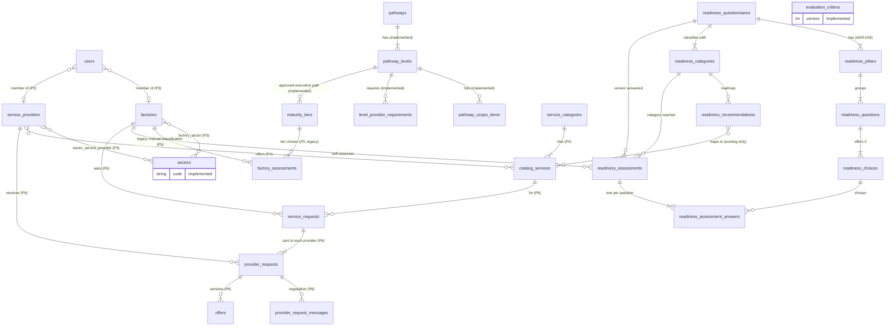
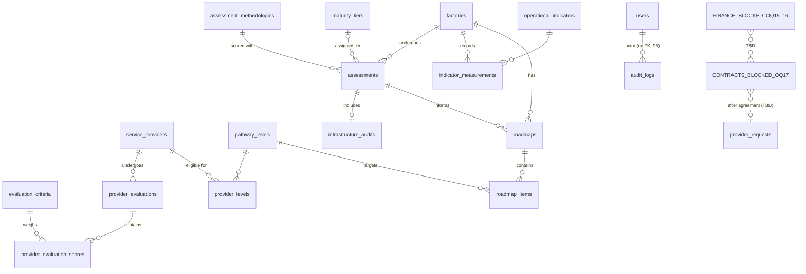

# Data Model

**Status:** Phases 4–6 (2026-10-03). Section 1 is the **existing** schema. Section 3 marks each entity as **Implemented** or still **PROPOSED/blocked**. Section 2's ERDs show both. Phase 7 (billing) added nothing: it is blocked.

## 1. Existing schema (verified)

Engine: MySQL driver against local MariaDB 10.4.32; the test suite also passes on MySQL 8.4.9 (port 3307, since 2026-10-03) ([ADR-004](decisions/ADR-004-database-mysql.md)). Databases `jahez` (dev) and `jahez_testing` (tests), `utf8mb4_unicode_ci`. Sources: the skeleton migrations `database/migrations/0001_01_01_00000{0,1,2}_*.php`, plus Sanctum's `2026_10_02_172319_create_personal_access_tokens_table.php` (Phase 1).

| Table | Columns | Keys / indexes |
| --- | --- | --- |
| `users` | id, name, email, email_verified_at, password, **role(30)**, **factory_id?**, **service_provider_id?**, remember_token, **deactivated_at?**, timestamps | PK id; UNIQUE email; FK factory_id → factories RESTRICT; FK service_provider_id → service_providers RESTRICT; **CHECK `users_role_organization_check`** (admin: no organization; factory_member: factory only; provider_member: provider only) |
| `password_reset_tokens` | email, token, created_at | PK email |
| `sessions` | id, user_id, ip_address(45), user_agent, payload, last_activity | PK id; INDEX user_id; INDEX last_activity. **Unused**: the API starts no sessions ([ADR-013](decisions/ADR-013-api-only.md)) |
| `cache` / `cache_locks` | key, value/owner, expiration | PK key; INDEX expiration |
| `jobs` | id, queue, payload, attempts, reserved_at, available_at, created_at | PK id; INDEX queue |
| `job_batches` | id, name, totals, failed_job_ids, options, cancelled_at, created_at, finished_at | PK id |
| `failed_jobs` | id, uuid, connection, queue, payload, exception, failed_at | PK id; UNIQUE uuid |
| `personal_access_tokens` (Sanctum, Phase 1) | id, tokenable_type, tokenable_id, name, token, abilities, last_used_at, expires_at, timestamps | PK id; UNIQUE token; INDEX (tokenable_type, tokenable_id); INDEX expires_at. Used since Phase 3 (8-hour tokens). |
| `pathways` (P2) | id, code(50), name_ar, name_en?, target_group_ar, sort_order, timestamps | PK id; UNIQUE code |
| `pathway_levels` (P2) | id, pathway_id, code(50), name_ar, subtitle_ar?, name_en?, target_group_ar, sort_order, timestamps | PK id; UNIQUE code; FK pathway_id → pathways RESTRICT |
| `pathway_scope_items` (P2) | id, pathway_level_id, group_ar?, group_en?, text_ar, sort_order, timestamps | PK id; UNIQUE (pathway_level_id, sort_order); FK → pathway_levels RESTRICT |
| `level_provider_requirements` (P2) | id, pathway_level_id, text_ar, sort_order, timestamps | PK id; UNIQUE (pathway_level_id, sort_order); FK → pathway_levels RESTRICT |
| `maturity_tiers` (P2) | id, pathway_level_id, code(50), name_ar, name_en?, readiness_band_ar, **score_min? / score_max? DECIMAL(5,2) (NULL, not fillable)**, operational_state_ar, approved_path_ar, expected_impact_ar, sort_order, timestamps | PK id; UNIQUE code; FK pathway_level_id → pathway_levels RESTRICT |
| `sectors` (P2) | id, code(50), name_ar, name_en?, sort_order, timestamps | PK id; UNIQUE code |
| `evaluation_criteria` (P2) | id, version, code(50), name_ar, name_en?, sub_elements_ar, weight_percent DECIMAL(5,2), verification_ar, sort_order, timestamps | PK id; UNIQUE (version, code) |
| `factories` (P3) | id, name, **size(20)?** (OQ-04 interim), timestamps | PK id; INDEX size. Members edit name and sectors since P5; the size is set by IMC from a configurable list. |
| `service_providers` (P3, P4) | id, name, **representative_name?, job_title?, email?, phone?(30), website?, dx_experience_years? (tinyint), approval_status(20) default `pending`, approval_reason?, approval_changed_at?** (P4), timestamps | PK id; INDEX approval_status. Workbook fields and IMC approval ([ADR-014](decisions/ADR-014-catalog-and-provider-profiles.md)) |
| `factory_sector` (P3) | factory_id, sector_id | PK (factory_id, sector_id); FK factory CASCADE; FK sector RESTRICT |
| `sector_service_provider` (P3) | service_provider_id, sector_id | PK (service_provider_id, sector_id); FK provider CASCADE; FK sector RESTRICT |
| `audit_logs` (P8) | id, event(100), actor_user_id?, subject_type(50)?, subject_id?, ip_address(45)?, request_id(128)?, metadata JSON?, created_at | PK id; INDEX (actor_user_id, id); INDEX (subject_type, subject_id, id); INDEX (event, id); INDEX created_at. **No foreign key on `actor_user_id`, deliberately** (a foreign-key check would lock the actor's `users` row and can deadlock with the administrator locks). Append-only in the application ([ADR-012](decisions/ADR-012-audit-log.md)). |
| `service_categories` (P4) | id, code(50), name_ar, name_en?, source_ref(30), sort_order, timestamps | PK id; UNIQUE code. 7 rows from the workbook |
| `catalog_services` (P4) | id, service_category_id, code(60), name_ar, source_ref(30), sort_order, timestamps | PK id; UNIQUE code; UNIQUE (service_category_id, sort_order); FK category RESTRICT. 42 rows from the workbook |
| `catalog_service_service_provider` (P4) | catalog_service_id, service_provider_id | PK (both); FK service RESTRICT; FK provider CASCADE |
| `factory_assessments` (P5, **legacy**) | id, factory_id, maturity_tier_id, justification, assessed_on (date), recorded_by_user_id, created_at | PK id; FKs RESTRICT; INDEX (factory_id, id). **No score column.** Append-only, read-only since ADR-018 ([ADR-016](decisions/ADR-016-manual-factory-classification.md), superseded) |
| `readiness_questionnaires` (ADR-018) | id, version (smallint), title_ar, title_en?, source_ref, is_current? (true or NULL), published_at?, created_by_user_id?, updated_by_user_id?, published_by_user_id? (FK users, RESTRICT; NULL for the seeded version 1), timestamps | PK id; UNIQUE version; UNIQUE is_current (at most one current version). 1 row (version 1, RDA) |
| `readiness_pillars` | id, readiness_questionnaire_id, code(50), name_ar, name_en?, sort_order, timestamps | PK id; UNIQUE (questionnaire, code); FK RESTRICT. 5 rows |
| `readiness_questions` | id, readiness_questionnaire_id, readiness_pillar_id, code(20) (`q1`…`q10`), number, text_ar, source_ref, timestamps | PK id; UNIQUE (questionnaire, code); UNIQUE (questionnaire, number); FKs RESTRICT. 10 rows |
| `readiness_choices` | id, readiness_question_id, code(10) (`a`…`d`), label_ar (أ…د), text_ar, points (tinyint), sort_order, timestamps | PK id; UNIQUE (question, code); UNIQUE (id, question) for the answers' composite key; FK RESTRICT. 40 rows (points 1–4) |
| `readiness_categories` | id, readiness_questionnaire_id, code(50) (`b4_automation`, `basic`, `advanced`, `smart`), name_en, name_ar, description_ar, min_score, max_score, focus_ar, steps_ar, sort_order, timestamps | PK id; UNIQUE (questionnaire, code); UNIQUE (id, questionnaire); FK RESTRICT. 4 rows: 10–17, 18–25, 26–33, 34–40 |
| `readiness_recommendations` | id, readiness_category_id, sort_order, text_ar, source_ref, timestamps | PK id; UNIQUE (category, sort_order); FK RESTRICT. 48 rows |
| `catalog_service_readiness_recommendation` | catalog_service_id, readiness_recommendation_id | PK (both); FK service RESTRICT, recommendation CASCADE. 45 rows, to existing catalog services only |
| `readiness_assessments` | id, factory_id, readiness_questionnaire_id, readiness_category_id, total_score, submitted_by_user_id, idempotency_key? (UNIQUE with factory_id), completed_at | PK id; FKs RESTRICT; **composite FK (category, questionnaire) → categories(id, questionnaire)**; INDEX (factory_id, completed_at, id). Append-only; the model refuses a total and category that do not match |
| `readiness_assessment_answers` | id, readiness_assessment_id, readiness_question_id, readiness_choice_id, points (copied at submission), question_text_ar?, choice_label_ar?, choice_text_ar? (text snapshot at submission; backfilled for earlier rows) | PK id; UNIQUE (assessment, question); **composite FK (choice, question) → choices(id, question)**; FKs RESTRICT. Append-only |
| `provider_evaluations` (P4 follow-up) | id, service_provider_id, criteria_version, summary, evaluated_on (date), scale_max? , weighted_total? DECIMAL(5,2), pass_mark? DECIMAL(5,2), recorded_by_user_id, created_at | PK id; FKs RESTRICT; INDEX (service_provider_id, evaluated_on, id). Append-only. Scores and totals only when the owner approves a scale (OQ-13) |
| `provider_evaluation_scores` (P4 follow-up) | id, provider_evaluation_id, evaluation_criterion_id, score? DECIMAL(6,2), note | PK id; UNIQUE (provider_evaluation_id, evaluation_criterion_id); FK evaluation CASCADE, criterion RESTRICT. Append-only |
| `service_requests` (P6) | id, factory_id, catalog_service_id, title(200), need, requirements?, status(20) default `open`, status_changed_at?, created_by_user_id, timestamps | PK id; FKs RESTRICT; INDEX (factory_id, id); INDEX status ([ADR-015](decisions/ADR-015-marketplace-requests.md)) |
| `service_listing_packages` (ADR-027) | id, catalog_service_id, service_provider_id, position, name_ar(120), monthly_price DECIMAL(14,2)?, annual_price DECIMAL(14,2)?, users_count?, timestamps | composite FK → `catalog_service_service_provider` CASCADE; UNIQUE (listing, position); CHECK at least one price, prices ≥ 0, users ≥ 1 |
| `service_cart_items` (ADR-027) | id, user_id, catalog_service_id, service_provider_id, service_listing_package_id?, billing_period(10)?, users_count?, timestamps | FK user CASCADE; composite FK → listing CASCADE; FK package SET NULL; UNIQUE (user, listing); CHECK period ∈ monthly/annual, users ≥ 1 |
| `provider_requests` (P6; `selection` JSON? ADR-027: the cart choice copied at sending) | id, service_request_id, service_provider_id, status(20) default `pending`, status_reason?, status_changed_at?, agreed_offer_id?, selection?, timestamps | PK id; UNIQUE (service_request_id, service_provider_id); INDEX (service_provider_id, id); FKs RESTRICT (agreed_offer_id → offers) |
| `provider_request_messages` (P6) | id, provider_request_id, author_user_id, author_side(10), body, created_at | PK id; FKs RESTRICT; INDEX (provider_request_id, id). Append-only |
| `offers` (P6) | id, provider_request_id, version (smallint), scope, deliverables, duration_days, price_amount **DECIMAL(14,2)**, currency CHAR(3) (`EGP`), **valid_until? (date, set by the provider)**, author_user_id, created_at | PK id; UNIQUE (provider_request_id, version); FKs RESTRICT. Append-only versions; informational price, no invoice |
| `provider_request_transitions` (P6 follow-up) | id, provider_request_id, from_status(20)?, to_status(20), reason?, actor_user_id? (indexed, no FK, as the audit log), created_at | PK id; FK provider request RESTRICT; INDEX (provider_request_id, id). Append-only status history shown to both parties |
| `agreements` (P7 domain) | id, provider_request_id, service_request_id, factory_id, service_provider_id, catalog_service_id, offer_id, price_amount **DECIMAL(14,2)**, currency CHAR(3), concluded_by_user_id? (indexed, no FK), concluded_at | PK id; UNIQUE provider_request_id; UNIQUE offer_id; FKs RESTRICT; INDEX (factory_id, id), (service_provider_id, id). Immutable ([ADR-017](decisions/ADR-017-agreements-contracts-billing.md)) |
| `contracts` (P7 domain) | id, agreement_id, version, status(20) default `draft`, knowledge_transfer_trainees (tinyint, ≥2), knowledge_transfer_plan, notes?, drafted_by_user_id, status_reason?, status_changed_by_user_id?, status_changed_at?, timestamps | PK id; UNIQUE (agreement_id, version); FK agreement RESTRICT; INDEX status. Drafts only, never binding (OQ-17) |
| `invoices` (P7 domain) | id, agreement_id, number(50)? (set on issue), status(20) default `draft`, issuer(20), currency CHAR(3), subtotal_amount, tax_rate_percent?, tax_amount?, total_amount?, revenue_share_percent?, revenue_share_amount? (**DECIMAL(14,2)**, rates DECIMAL(5,2)), created_by_user_id, issued_by_user_id?, issued_at?, paid_at?, status_reason?, status_changed_at?, timestamps | PK id; UNIQUE number; FK agreement RESTRICT; INDEX status, (agreement_id, id). Tax, total and number only on issue, under owner-set rules (OQ-16) |
| `invoice_lines` (P7 domain) | id, invoice_id, position, description(500), quantity (whole), unit_amount, line_amount DECIMAL(14,2), timestamps | PK id; UNIQUE (invoice_id, position); FK invoice CASCADE |
| `invoice_number_sequences` (P7 domain) | prefix(20), last_number, timestamps | PK prefix; row locked while issuing (gap-free numbers) |
| `payments` (P7 domain) | id, invoice_id, gateway(50), gateway_reference(191)?, idempotency_key(100), status(20) default `pending`, amount DECIMAL(14,2), currency, checkout_url?, failure_reason?, initiated_by_user_id, status_changed_at?, timestamps | PK id; UNIQUE (invoice_id, idempotency_key); UNIQUE (gateway, gateway_reference); FK invoice RESTRICT. Status changes only on verified gateway evidence |
| `payment_events` (P7 domain) | id, gateway, event_id(191), payment_id?, gateway_reference, reported_status, reported_amount, reported_currency, source (callback or reconciliation), outcome, created_at | PK id; UNIQUE (gateway, event_id): each gateway event applied at most once; append-only |

`?` means nullable. Migrations are under `database/migrations/2026_10_02_18000{1..7}_*.php`, numbered in foreign-key dependency order. Design decisions are in [ADR-010](decisions/ADR-010-reference-data.md).

Migration checks:
- Phase 0: migrate → rollback → migrate → fresh on scratch SQLite ([log](phases/phase-00-discovery.md#4-migration-check-separate-scratch-database)).
- Phase 1: the same cycle on scratch **MySQL** ([log](phases/phase-01-foundation.md#4-test-and-check-results)).
- Phase 2: migrate, seed twice, rollback with seeded data present, then fresh `--seed`, all on scratch MySQL ([log](phases/phase-02-data-model.md#4-test-and-check-results)).

## 2. ERD

Tables migrated in Phase 2 are in the first block. Everything else is still PROPOSED. Blocked areas appear as placeholder boxes.

PROPOSED (not migrated):

## 3. Entity catalogue

| Entity | Purpose | Source basis | Label | Key proposed constraints | Blocked by |
| --- | --- | --- | --- | --- | --- |
| `users` | Login identity for IMC staff, factory and provider members | — | **Implemented (P3)** ([ADR-006](decisions/ADR-006-roles-and-permissions.md)) | UNIQUE email; role and organization never mass-assignable; DB CHECK | Registration model: [OQ-18](open-questions.md#oq-18) |
| ~~`factory_members`, `provider_members`~~ | Replaced in P3 by nullable `users.factory_id` / `users.service_provider_id` with a CHECK constraint: one organization per user, real FKs, no extra tables | — | Superseded | — | — |
| `sectors` | Industrial sectors | DOC §1 p.2 | **Implemented (P2)** | UNIQUE `code`; names verbatim from DOC | Completeness: [OQ-05](open-questions.md#oq-05); English: [OQ-23](open-questions.md#oq-23) |
| `pathways` | The two transformation pathways | DOC §3 p.3–4 | **Implemented (P2)** | UNIQUE `code` | — |
| `factories` | Factory organization | DOC §1 | **Implemented: name, declared size (OQ-04 interim), sectors** (D4); members edit name and sectors (P5) | — | Fields: [OQ-04](open-questions.md#oq-04), [OQ-19](open-questions.md#oq-19) |
| `factory_sector` | Factory ↔ sector | DOC §1 | **Implemented (P3)**, many-to-many | PK (factory_id, sector_id) | [OQ-05](open-questions.md#oq-05) |
| `service_providers` | Provider organization | DOC §7; WB rows 1–9 | **Implemented (P4)**: workbook fields, sectors, services, IMC approval | — | Required fields: [OQ-36](open-questions.md#oq-36); type (consulting vs technology): R-ACT-04 |
| `sector_service_provider` | Provider target sectors | Master prompt only | **Implemented (P3)** as interim (D4) | PK (service_provider_id, sector_id) | [OQ-20](open-questions.md#oq-20) |
| `pathway_levels` | Foundational pathway + Basic/Advanced/Smart DX levels (4 rows) | DOC §3 | **Implemented (P2)** | UNIQUE `code`; FK pathway_id (replaces the earlier `pathway` enum idea) | — |
| `pathway_scope_items` | Scope items per level (Arabic text verbatim) | DOC §3 | **Implemented (P2)** | FK pathway_level_id; UNIQUE (pathway_level_id, sort_order) | — |
| `level_provider_requirements` | الاشتراطات الفنية الخاصة بمقدم الخدمة per DX level | DOC §3 p.4–5 | **Implemented (P2)** (text); enforcement OPEN-QUESTION | FK pathway_level_id; UNIQUE (pathway_level_id, sort_order) | Enforcement: [OQ-14](open-questions.md#oq-14) |
| `maturity_tiers` | 4 tiers, qualitative band, operational state, expected impact, approved path | DOC §4 | **Implemented (P2)**; `score_min`/`score_max` **NULL and not fillable until [OQ-07](open-questions.md#oq-07)** | UNIQUE `code`; FK pathway_level_id | Thresholds: [OQ-07](open-questions.md#oq-07) |
| `evaluation_criteria` | 5 provider-evaluation criteria and weights | DOC §6 | **Implemented (P2)**, as version 1 | UNIQUE (version, code); version 1 weights total 100.00 (tested) | Scale and pass mark: [OQ-13](open-questions.md#oq-13) |
| `provider_evaluations` | One evaluation round of a provider | DOC §6, §7.4 | **Implemented (OQ-13 interim)**: written assessment per criterion; scores, total and pass-mark result only with an approved scale and pass mark | FK provider, recorder; append-only | [OQ-13](open-questions.md#oq-13) |
| `provider_evaluation_scores` | Note and optional score per criterion | DOC §6 | **Implemented (OQ-13 interim)**; the weight is read from the versioned criterion | UNIQUE (provider_evaluation_id, evaluation_criterion_id) | [OQ-13](open-questions.md#oq-13) |
| `provider_levels` | Provider eligibility for a DX level | DOC §3 | PROPOSED | UNIQUE (service_provider_id, pathway_level_id) | [OQ-14](open-questions.md#oq-14) |
| `assessment_methodologies` | Versioned readiness-index definition | DOC §2.1 | **Implemented as `readiness_questionnaires` (ADR-018)** | UNIQUE version | — |
| `assessments` | Readiness assessment of a factory; maturity score; assigned category | DOC §2, §4, §7.1; RDA | **Implemented as `readiness_assessments` (ADR-018)**: score and category computed by the server from RDA | FK factory (restrict delete) | [OQ-08](open-questions.md#oq-08) (expert validation) |
| assessment answers / dimension scores | Raw inputs per pillar | RDA §4 | **Implemented as `readiness_assessment_answers`**; pillar scores are computed from them | — | — |
| `infrastructure_audits` | Infrastructure & cyber readiness audit | DOC §2.3 | SOURCE-REQUIRED (concept); fields OPEN-QUESTION | — | [OQ-10](open-questions.md#oq-10) |
| `operational_indicators` | Baseline/KPI indicator definitions (unit, direction) | DOC §2.2, §8 | PROPOSED | UNIQUE `code` | [OQ-11](open-questions.md#oq-11) |
| `indicator_measurements` | Baseline, 6-month and 12-month values per factory | DOC §2.2, §7.5 | SOURCE-REQUIRED (concept) | `value` DECIMAL; `period` enum; UNIQUE (factory_id, indicator_id, roadmap_id, period) | [OQ-11](open-questions.md#oq-11) |
| `roadmaps`, `roadmap_items` | 2–3-year transformation path | DOC §1, §7.2 | **Implemented as transformation plans (ADR-025)**, see below | — | [OQ-12](open-questions.md#oq-12), [OQ-55](open-questions.md#oq-55) |
| `readiness_level_services` | Catalog services IMC makes available to each readiness level | Owner brief 2026-10-05 | **Implemented (ADR-025)**; nothing seeded; cumulative: a row also serves every higher level (ADR-026) | UNIQUE (level, catalog_service_id); CHECK level ∈ four category codes; FK catalog service restrict | — |
| `readiness_level_unlocks` | Levels a factory opened by completing its plan's services of the level below: factory_id, level, from_level, transformation_plan_id, unlocked_by_user_id, unlocked_at | Owner request 2026-10-06 | **Implemented (ADR-026)**; append-only | UNIQUE (factory_id, level); CHECK level ∈ basic/advanced/smart, from_level ∈ b4_automation/basic/advanced; FKs restrict | [OQ-56](open-questions.md#oq-56) |
| `transformation_plans` | A factory's transformation plan (status, readiness basis) | Owner brief 2026-10-05 | **Implemented (ADR-025)** | UNIQUE (factory_id, is_open) = one open plan; CHECK status/is_open; FKs restrict | [OQ-53](open-questions.md#oq-53) |
| `transformation_plan_versions` | Draft, published and superseded versions | ADR-025 | **Implemented** | UNIQUE (plan, version), (plan, is_draft), (plan, is_published); CHECK status markers; `revision` for optimistic saves | — |
| `transformation_plan_items` | One catalog service per plan, with its execution status (survives versions) | ADR-025 | **Implemented**; status recorded by IMC | UNIQUE (plan, catalog_service); CHECK execution_status | [OQ-52](open-questions.md#oq-52) |
| `transformation_plan_stages`, `transformation_plan_stage_items`, `transformation_plan_dependencies` | Ordered stages, item placements (order, assigned provider, instructions, notes, dates) and finish-to-start dependencies of one version | ADR-025 | **Implemented** | UNIQUE (version, position), (stage, position), (version, item), (stage_item, depends_on); composite FKs keep stage, placement and dependency in one version; CHECK no self-dependency; cycles refused by the application; all FKs restrict | [OQ-54](open-questions.md#oq-54) |
| `service_requests.transformation_plan_item_id` | The plan item a request was sent for | ADR-025 | **Implemented**, nullable | FK restrict; one live request per item checked under the item lock | — |
| `audit_logs` | Append-only record of security events (actor, event, subject, IP, request ID, timestamp) | — | **Implemented (P8)** | No update/delete path in the app; `metadata` JSON sanitised (never secrets or tokens); subject names `user`/`factory`/`service_provider`; indexes in §1 | [OQ-25](open-questions.md#oq-25) (retention) |
| `personal_access_tokens` | Sanctum tokens | — | **In use (P3)**: bearer-only, 8 hours | Created by Sanctum migration | [OQ-22](open-questions.md#oq-22) |
| `notifications` | Laravel database notifications | — | PROPOSED | Framework migration | [OQ-26](open-questions.md#oq-26) |
| **Catalog** (categories, services, provider ↔ service) | Seven categories + 42 services | WB rows 11–61 | **Implemented (P4)**: `service_categories`, `catalog_services`, `catalog_service_service_provider` | Source test against the file | — |
| **Engagements** (requests, provider responses, negotiation) | Factory ↔ provider work | OWNER-APPROVED marketplace | **Implemented (P6)**: `service_requests`, `provider_requests`, `provider_request_messages`, `offers`; states PROPOSED | Row locks; append-only messages and offers | [OQ-38](open-questions.md#oq-38), [OQ-39](open-questions.md#oq-39) |
| **Contracts** | Agreements, knowledge-transfer commitment | DOC §5, §6 (partial) | **Implemented as boundaries (ADR-017)**: immutable `agreements`; `contracts` drafts only, with the DOC §6 knowledge-transfer commitment; no signature | — | **[OQ-17](open-questions.md#oq-17)** |
| `financial_policies`, `financial_policy_versions` | Versioned, approved financial and contract policies per kind and scope | Owner brief 2026-10-04 | **Implemented (ADR-023)**; no row seeded | UNIQUE (kind, scope_key); UNIQUE (policy, version); approved versions immutable (model guard); FKs restrict delete | [OQ-15](open-questions.md#oq-15), [OQ-16](open-questions.md#oq-16), [OQ-17](open-questions.md#oq-17), [OQ-47](open-questions.md#oq-47) |
| `user_permission_grants` | Permissions granted to one IMC administrator (`financial_policies.manage`, `.approve`, `payments.record`) | ADR-023 | **Implemented** | UNIQUE (user_id, permission); FK users restrict | [OQ-49](open-questions.md#oq-49) |
| **Finance** (revenue shares, invoices, payments) | Money flows | DOC §5 (concept) | **Boundaries built (ADR-017)**, rules from approved policies since ADR-023 (`policy_basis` legacy/policy; version FKs on agreements, contracts, invoices; `invoices.calculation`, `due_date`, `amount_paid`, `fees_amount`; `payments.method`, `received_on`): `invoices`, `invoice_lines`, `payments`, `payment_events`; every money operation waits for its owner-set rule (409 `policy_not_configured`); no gateway adapter ships; no payouts | — | **[OQ-15](open-questions.md#oq-15)**, **[OQ-16](open-questions.md#oq-16)** |

## 4. Reference data (seeded in Phase 2)

Seeded by `php artisan db:seed --class=ReferenceDataSeeder --force`. `DatabaseSeeder` also calls it. The seeders are idempotent and safe in production ([ADR-010](decisions/ADR-010-reference-data.md)). Arabic is authoritative and transcribed from the PDF page images. **It needs owner proofreading ([OQ-32](open-questions.md#oq-32)).** English is filled only where DOC prints it ([OQ-23](open-questions.md#oq-23) interim).

| Set | Seeder | Rows | DOC ref |
| --- | --- | --- | --- |
| Sectors | `SectorSeeder` | 4: الصناعات الغذائية؛ الصناعات الكيماوية؛ الصناعات الهندسية والمعدنية؛ الصناعات الطبية والدوائية | §1 p.2 |
| Pathways | `PathwaySeeder` | 2: foundational, digital_transformation (with target groups) | §3 p.3–4 |
| Pathway levels | `PathwaySeeder` | 4: Foundational Pathway; Basic DX (المؤسسة الرقمية); Advanced DX (المصنع المتقدم); Smart DX (المصنع الذكي); target groups from the p.5 summary table | §3 p.3–5 |
| Scope items | `PathwaySeeder` | 25: Foundational 6 (2 groups × 3), Basic DX 6, Advanced DX 7, Smart DX 6 | §3 p.3–5 |
| Provider requirements | `PathwaySeeder` | 9: 3 per DX level; none for Foundational (the source lists none) | §3 p.4–5 |
| Maturity tiers | `MaturityTierSeeder` | 4, with qualitative band, operational state, approved path and expected impact; thresholds NULL | §4 p.6 |
| Evaluation criteria | `EvaluationCriterionSeeder` | 5 (version 1), weights 30 / 25 / 20 / 15 / 10 (= 100) | §6 p.8 |

**Not seeded:** the service catalog (WB, [OQ-01](open-questions.md#oq-01)), score thresholds ([OQ-07](open-questions.md#oq-07)), readiness-index questions ([OQ-06](open-questions.md#oq-06)), scoring scale and pass mark ([OQ-13](open-questions.md#oq-13)), and revenue-share percentages ([OQ-15](open-questions.md#oq-15)). The 5–20% range appears only inside the descriptive `sub_elements_ar` text of the financial-flexibility criterion, as the source prints it. It is not a rule.

## 5. Conventions

Applied to the Phase 2 tables; PROPOSED for the rest.

- **Keys:** auto-increment `bigint` primary keys, matching the skeleton. Whether to expose opaque public IDs (ULID) for **tenant-owned** records is deferred to Phase 3, when the first such table is created. Reference data uses its `code` in APIs. Authorization, not ID opacity, is the IDOR defence.
- **Reference data (applied):** a stable `code` column (UNIQUE) is the seeder upsert key. Display text never serves as a key.
- **Closed sets:** stored as strings and backed by PHP enums (TitleCase cases). Changing a value means a migration plus an enum change.
- **Numbers:** scores and measurements use `DECIMAL`, never float. Precision and scale are chosen once the scales are known ([OQ-06](open-questions.md#oq-06), [OQ-11](open-questions.md#oq-11), [OQ-13](open-questions.md#oq-13)). Money (Phase 7 only) is `DECIMAL` with an explicit `currency` CHAR(3).
- **Versioning:** results (assessments, evaluations) reference the methodology version and snapshot the weights. A later change to weights must not alter historical results.
- **Deletion:** FKs to reference data and from financial records use `restrictOnDelete`. Never cascade-delete audit, financial or contract records. `audit_logs.actor_user_id` has no FK by design ([ADR-012](decisions/ADR-012-audit-log.md)); accounts are deactivated, never deleted. Soft deletes only where an approved retention rule needs them ([OQ-25](open-questions.md#oq-25)).
- **Charset:** `utf8mb4` / `utf8mb4_unicode_ci` (current MySQL/MariaDB config default) for Arabic text. Revisit the collation once the production engine is chosen ([OQ-24](open-questions.md#oq-24)). MariaDB 10.4 lacks the newer UCA 14 collations.
- **Time:** stored in UTC (`APP_TIMEZONE` is UTC today). The reporting timezone (probably Africa/Cairo) is confirmed with [OQ-27](open-questions.md#oq-27).
- **JSON columns:** only with a documented reason (for example sanitised `audit_logs.metadata`). Relational data stays relational.
- **Indexes:** each index is justified by an integrity rule or a measured query (`EXPLAIN`), not added speculatively. Candidate indexes are listed in section 3 and validated in Phases 2 and 10.

## 6. Test-database caveats (important for Phases 2, 6, 7)

- Since Phase 1, tests run on the **MySQL driver** (`jahez_testing`). Row locks (`lockForUpdate()`), foreign keys and unique constraints therefore behave as on a real MySQL-protocol server. SQLite is no longer used.
- The default local server is **MariaDB 10.4**. MySQL 8.4 runs beside it on port 3307, and the whole suite passes on both. Run concurrency tests on MySQL 8.4 (`DB_PORT=3307`). Run `EXPLAIN` analysis on the production MySQL version with production-like volumes ([ADR-004](decisions/ADR-004-database-mysql.md), [OQ-24](open-questions.md#oq-24)).
